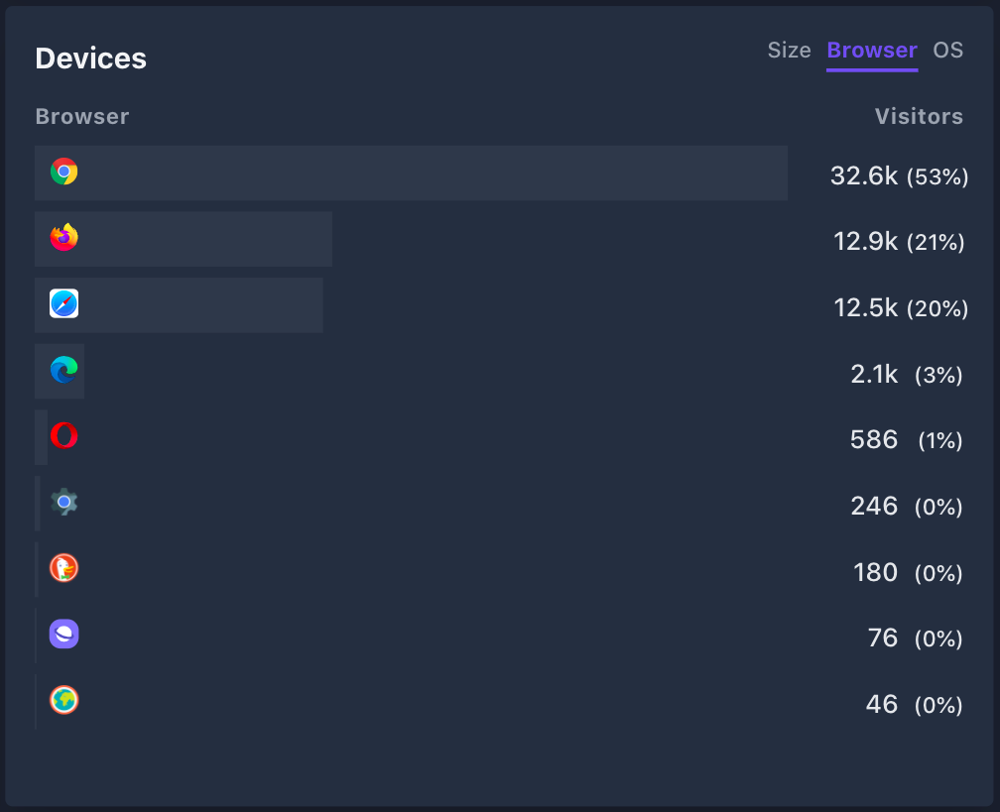

# Plausible More Logos
Adds browser and OS logos to [Plausible](https://plausible.io)'s dashboard using [Stylus](https://add0n.com/stylus.html). 
Whether the names are always visible or only shown on hover can be changed in the style's settings.

Logos are fetched from [github.com/alrra/browser-logos](https://raw.githubusercontent.com/alrra/browser-logos), icons.duckduckgo.com, cdn-static.ecosia.org, and [Wikimedia Commons](https://upload.wikimedia.org).

# Installation
 1. Install Stylus Browser Extension ([Firefox](https://addons.mozilla.org/en-US/firefox/addon/styl-us/), [Chromium-based](https://chrome.google.com/webstore/detail/stylus/clngdbkpkpeebahjckkjfobafhncgmne), [Opera](https://addons.opera.com/extensions/details/stylus/)).
 2. Install [plausible-more-logos.user.css](https://github.com/FlorianRaediker/plausible-more-logos/raw/main/plausible-more-logos.user.css).

# Screenshots

